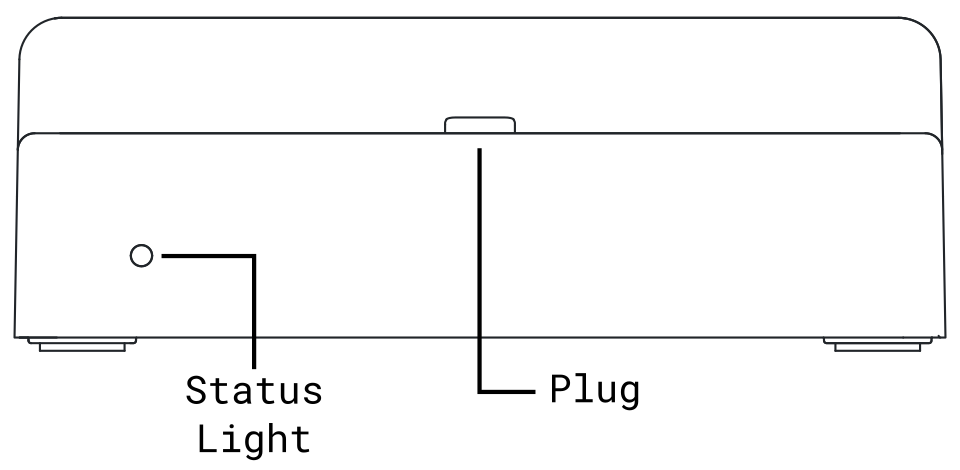
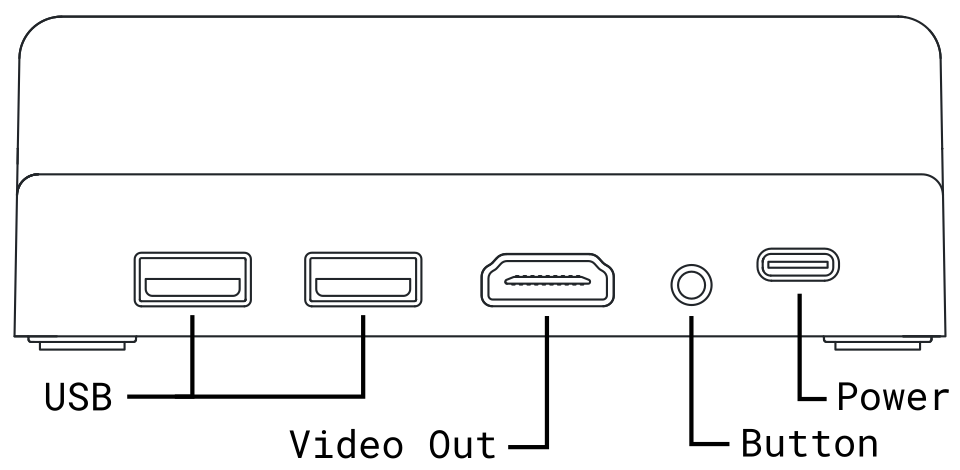

# Dock

The Game Bub Dock allows you to connect your Game Bub to an external TV and play on a big screen. It also adds support for external wireless controllers.

You can purchase a Dock from [Crowd Supply](https://www.crowdsupply.com/second-bedroom/game-bub#products).

<figure markdown="span"><figcaption>Front</figcaption> { width="480" }<figcaption>Rear</figcaption> { width="480" }</figure>

## Setting up your dock

Power the dock by connecting a 5V USB-C power supply to the rear USB-C port (minimum 1.5 A). Connect your TV or monitor to the video port on the rear of the device.

When the Dock is powered, the status light will be a dim red.

## Docking a Game Bub

Turn on your Game Bub, and gently slide it into the Dock with the screen facing forward. The screen will turn off, and the external display will turn on within a few seconds. The Dock's status light will turn *white* when a Game Bub is successfully docked.

You can remove your Game Bub from the Dock at any time. The screen will turn back on when it's undocked.

!!! warning

    Docking a Game Bub requires only minimal force. Do not force a Game Bub into the Dock, and ensure the USB-C connectors are properly aligned to avoid hardware damage.

!!! warning

    Do not tilt or transport a Game Bub and Dock together while they are connected, and remove the Game Bub from the Dock before inserting or removing game cartridges.

## Using external controllers

To pair a wireless controller, press and hold the button on the rear of the Dock until the front status light blinks blue. Follow your controller's instructions to complete pairing.

To cancel pairing, press and hold the button until it stops blinking.

The Dock uses [Bluepad32](https://bluepad32.readthedocs.io/en/latest/supported_gamepads/), which support includes the following controllers:

* Sony PlayStation 3, 4, and 5
* Xbox Wireless Series S/X (models 1708, 1914)
* Nintendo Switch Pro
* Nintendo Wii U Pro
* Nintendo Wii Classic Controller
* Most 8BitDo Bluetooth controllers

The Dock also has support for some wired USB controllers (and wireless controller USB dongles):

* Xbox Series X and Series S controllers
* Generic Xbox controllers (XInput)
* Other controllers and dongles that use the XInput protocol

To use a wired USB controller, simply plug it into one of the USB-A ports on the rear.
