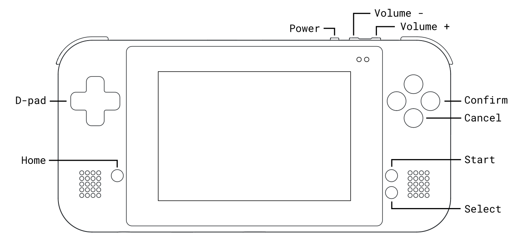
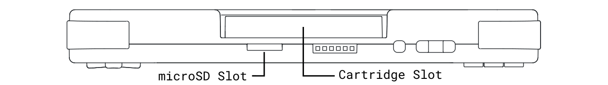
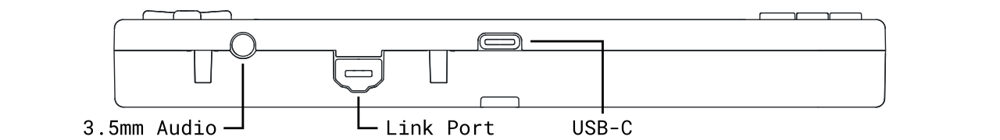
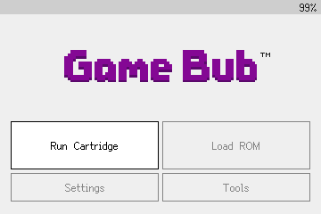

# Getting started

### Device diagram

<figure markdown="span"><figcaption>Front</figcaption> { width="640" }<figcaption>Top</figcaption> { width="640" }<figcaption>Bottom</figcaption> { width="640" }</figure>

### Power and charging

To turn on your Game Bub, press ++"Power"++. A glowing purple light indicates the device is booting up.

To turn Game Bub off, press the ++"Power"++ and select "Power Off" from the menu. To forcibly turn off an unresponsive device, hold ++"Power"++ for 7 seconds or until the device turns off.

Charge the device via the USB-C port on the bottom with a 5V power supply that can supply at least 1.5A. A solid orange light indicates the device is charging, and the light will turn off when the device is fully charged.

### Navigating menus

<figure markdown="span" style="image-rendering: pixelated;">
   <figcaption>Main Menu</figcaption>
</figure>

The first time you turn on your Game Bub, you'll go through a quick button tutorial and a regulatory information page.

Use the ++"D-Pad"++, ++"Confirm"++, and ++"Cancel"++ buttons to navigate menus.

Use ++"Volume\+"++ and ++"Volume\-"++ to adjust the audio volume. While holding ++"Home"++, press ++"Volume\+"++ and ++"Volume\-"++ to adjust the display brightness.
