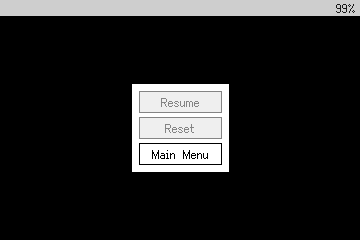
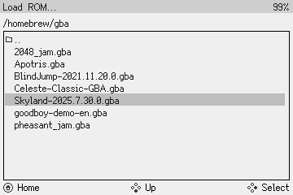

# Playing games

### Running cartridges

To play a Game Boy, Game Boy Color, or Game Boy Advance game, insert the game cartridge and select **Run Cartridge** from the Main Menu.

!!! warning

    To avoid data loss, only insert and remove game cartridges while the device is off or in the Main Menu.

Press ++"Home"++ to enter the in-game menu, where you can reset the game or return to the Main Menu. Make sure to save your progress in the game before exiting!

<figure markdown="span" style="image-rendering: pixelated;">
   <figcaption>In-game menu</figcaption>
</figure>

### Loading ROMs

You can also optionally use a microSD card to load homebrew game ROMs. First, format your microSD card with FAT32 (_not exFAT_), and insert it into the microSD slot while the device is off.

Then, turn on your Game Bub and select **Load ROM** from the Main Menu. Use the ++"D-Pad"++ to browse for the game you want to play, and press ++"Confirm"++ to load it.

<figure markdown="span" style="image-rendering: pixelated;">
   <figcaption>Load ROM menu</figcaption>
</figure>

### Custom BIOS files

The original Game Boy, Game Boy Color, and Game Boy Advance BIOS files are copyrighted by Nintendo and cannot be legally redistributed.

Instead, the Game Bub's built-in cores ship with free, open-source BIOS replacements (GB and GBC derived from [SameBoy](https://sameboy.github.io/), GBA derived from [Cult-of-GBA/BIOS](https://github.com/Cult-of-GBA/BIOS/)).

In addition to not showing the classic system boot screen, these replacement BIOSes have other limitations:

* GBC: does not support Game Boy compatibility mode palette selection
* GBA: does not support the "multi-boot" feature
* GBA: incompatibilities cause bugs in certain games

While the original files cannot be distributed with Game Bub, you *can* supply them yourself via the microSD card.

Create a directory called `system` on the root of the microSD card, and add the original BIOS files there.

| System | File Name              | Size (bytes) | Official BIOS hash (SHA-1)                 |
| ------ | ---------------------- | ------------ | ------------------------------------------ |
| GB     | `gameboy.bios-dmg.bin` | 256          | `4ed31ec6b0b175bb109c0eb5fd3d193da823339f` |
| GBC    | `gameboy.bios-cgb.bin` | 2304         | `1293d68bf9643bc4f36954c1e80e38f39864528d` |
| GBA    | `gba.bios.bin`         | 16384        | `300c20df6731a33952ded8c436f7f186d25d3492` |
