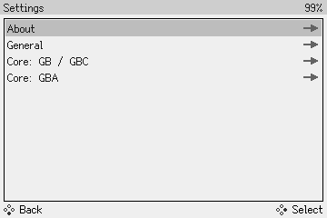

# Settings

To change device settings, open the **Main Menu** and select **Settings**.

<figure markdown="span" style="image-rendering: pixelated;">
  
</figure>

### About

The *About* section shows information about your device's hardware and software.

If the Game Bub is plugged into a Dock, it will also show information about the Dock.

### General

* **Date and Time (UTC)**: Adjust the system's date and time, in [UTC](https://en.wikipedia.org/wiki/Coordinated_Universal_Time).
    * Press Confirm to start editing, use the D-Pad to modify, and press Confirm again to save the modified time.
* **Startup Action**: change the behavior of the device at boot
    * *Main Menu* (default): open the main menu
    * *Run Cartridge*: skip the menu, immediately run the inserted game cartridge

### Core: GB / GBC

This section controls the built-in Game Boy and Game Boy Color core.

* **Enable GB Mode**: Set the emulated device model
    * *Off* (default): emulate a [Game Boy Color (CGB)](https://en.wikipedia.org/wiki/Game_Boy_Color)
    * *On*: emulate an original [Game Boy (DMG)](https://en.wikipedia.org/wiki/Game_Boy)
* **GBC Color Corrections**: set the color correction profile used in Game Boy Color mode
    * *None*: no color corrections (sRGB)
    * *GBC* (default): Game Boy Color
    * *GBA*: Game Boy Advance
    * *GBA SP*: Game Boy Advance SP
* **GB Color Palette**: set the color palette used in Game Boy mode
    * *Grayscale*: shades of gray
    * *DMG Green*: bright green, like the original Game Boy (DMG)
    * *GB Pocket*: soft green, like the Game Boy Pocket

### Core: GBA

This section controls the built-in Game Boy Advance core.

* **Color Corrections**: set the color correction profile
    * *None*: no color corrections (sRGB)
    * *GBA* (default): Game Boy Advance
    * *GBA SP*: Game Boy Advance SP
    * *NDS*: Nintendo DS (original)
    * *NDS Lite*: Nintendo DS Lite
    * *NSO GBA*: alternate Game Boy Advance (from Nintendo Switch Online)
* **Enable Game Boy Player**: Emulate the [Game Boy Player](https://en.wikipedia.org/wiki/Game_Boy_Player). This enables rumble in [supported games](https://en.wikipedia.org/wiki/Game_Boy_Player#Rumble_enabled). However, [GBA Video](https://en.wikipedia.org/wiki/Game_Boy_Advance_Video) cartridges will refuse to work.
    * *Off* (default): disable Game Boy Player emulation
    * *On*: enable Game Boy Player emulation
* **Warn about missing BIOS**: Show a compatibility warning if no GBA BIOS was found when launching a game
    * *Off*: disable the warning
    * *On* (default): enable the warning