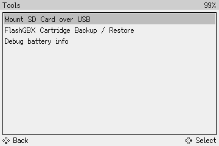
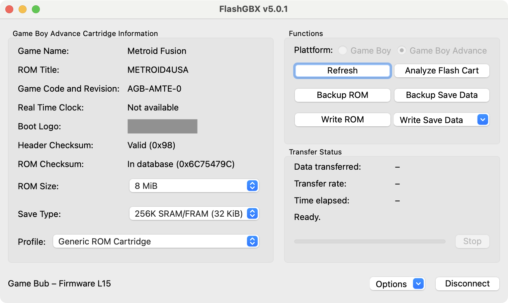

# Tools

Game Bub has a few useful tools built-in. To access them, open the **Main Menu** and select **Tools**.

<figure markdown="span" style="image-rendering: pixelated;">
  
</figure>

## Mount SD Card over USB

This tool lets you use Game Bub as a USB microSD card adapter. After selecting this option, plug Game Bub into a computer over USB, and you'll be able to read and write files on the microSD card.

It may take several seconds for the drive to show up, please be patient.

!!! tip "Transfer speeds"

    Transfer speeds are limited to USB 1.1 speeds (< 1 MB/sec), so this is primarily useful for transferring small files, like save games or configuration.

    If you're transferring a lot of data or many small files, a dedicated microSD card reader will be much faster and more reliable.

## FlashGBX Cartridge Backup / Restore

This tool lets you use Game Bub as a Game Boy and Game Boy Advance cartridge reader/writer, using the [FlashGBX](https://github.com/lesserkuma/FlashGBX) software by Lesserkuma.

1. Select "FlashGBX Cartridge Backup / Restore"
2. Connect Game Bub to a computer via the USB-C connector
3. [Download FlashGBX v5.0 or later](https://github.com/Lesserkuma/FlashGBX/releases)
4. Open FlashGBX, and it should automatically discover and connect to your Game Bub

<figure markdown="span">
  
</figure>

Game Bub supports almost all of the features of FlashGBX, including dumping cartridges, backing up and restoring save files, and analyzing/rewriting flashcarts and repro carts.

Known limitations:

* Cartridge voltage (3.3 V or 5.0 V) is set automatically based on cartridge shape, so certain obscure Game Boy flashcarts that require 3.3 V to be rewritten won't work
* Certain flashcarts (very rare) that require pull-down resistors on data lines won't work

*Thank you to Lesserkuma for helping us add Game Bub support to FlashGBX.*

## Debug battery info

This shows some information about the battery: charge status, voltage, and current.
